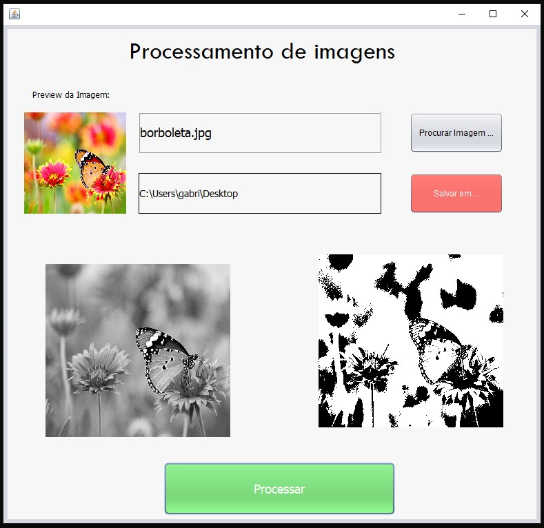

# Processamento de Imagens

_[Lena Söderberg](https://en.wikipedia.org/wiki/Lenna)_

Esse repositório contém desafios e projetos desenvolvidos em 2020, durante a disciplina de Processamento de Imagens do curso de Ciências da Computação da Universidade Cruzeiro do Sul. 

As principais tecnologias utilizadas nessa disciplina foram:
- Python 
- Java
- Open CV

## Projeto - Processador de Imagens

Nesse projeto, construiu-se um processador de imagens em Java. Com ele pode-se selecionar uma imagem colorida e transformá-la para tons de cinza e preto e branco. Os arquivos do projeto e outras informações estão disponíveis na pasta [Projeto](./Projeto).

_Abaixo uma demonstração:_

### Captura de tela do programa em Java

_Fonte: Elaborada pelo Autor_

### Imagem colorida encontrada na internet

_Fonte: [pexels.com](https://www.pexels.com/pt-br/)_

Selecionou-se essa colorida imagem (original) para demonstrar o software.

### Imagem processada em Tons de Cinza

_Fonte: Elaborada pelo Autor_

Esse é o resultado da imagem original em tons de cinza.

### Imagem processada em Branco e Preto

_Fonte: Elaborada pelo Autor_

Esse é o resultado da imagem original em preto e branco.

## Lista de Exercícios de Processamento de Imagens - Sistema de Cores

[Acesse o arquivo em PDF](https://github.com/GabrielGustavoMS/processamentoDeImagens/blob/master/Projeto/Trabalho-ProcessamentoDeImagens.pdf)

